# 人力资源管理系统

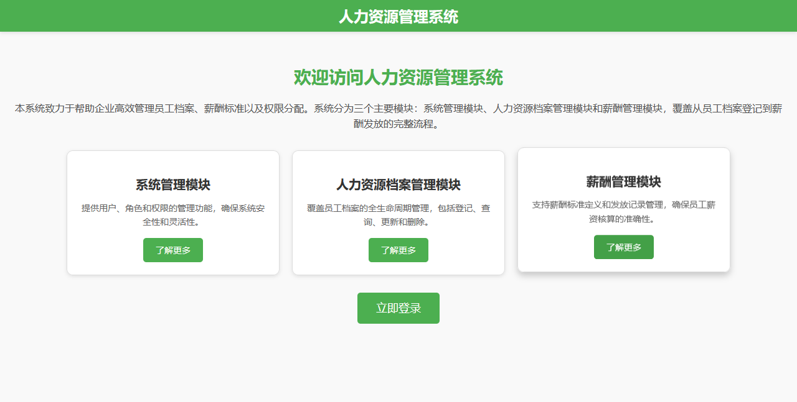

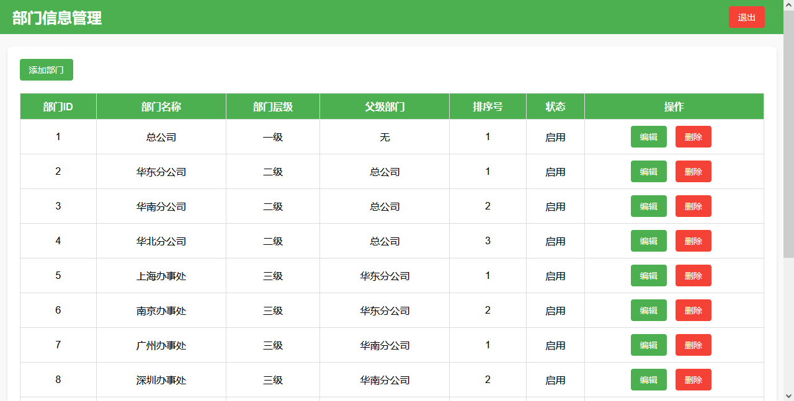

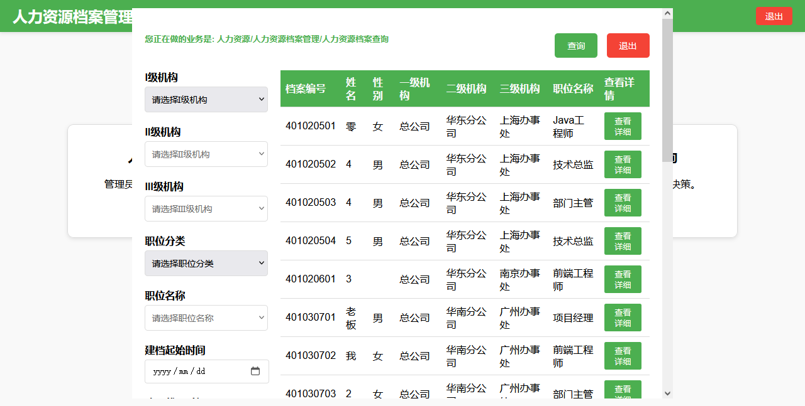

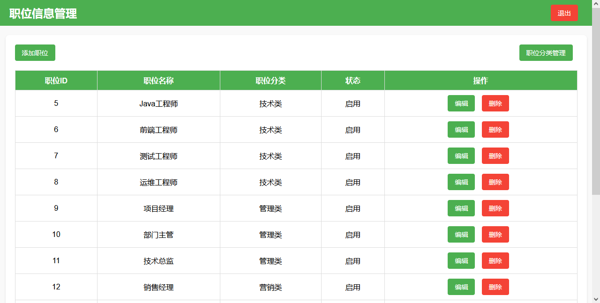

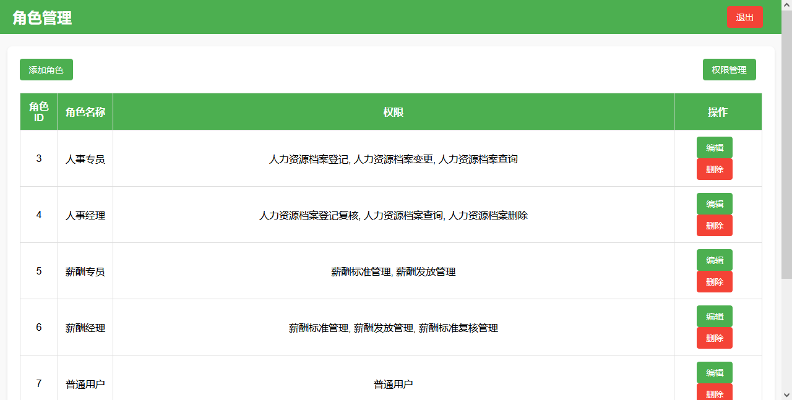

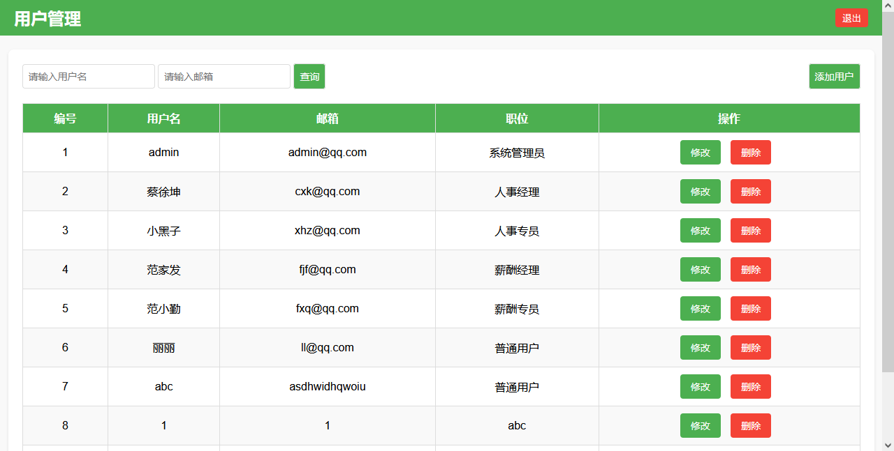

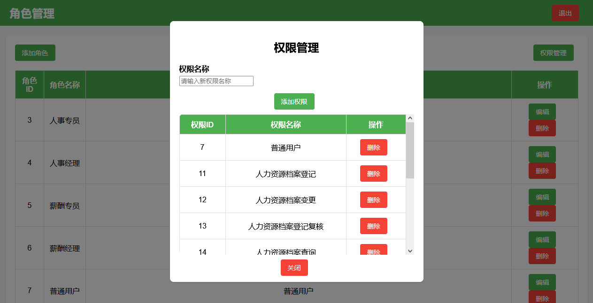

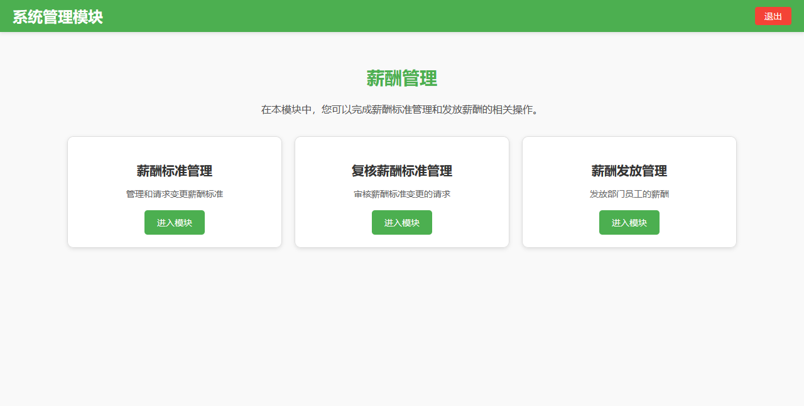

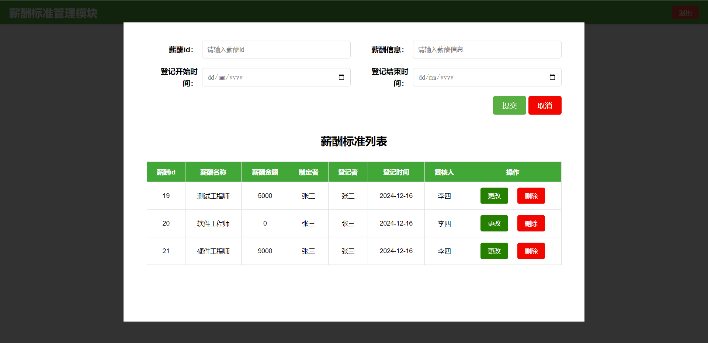

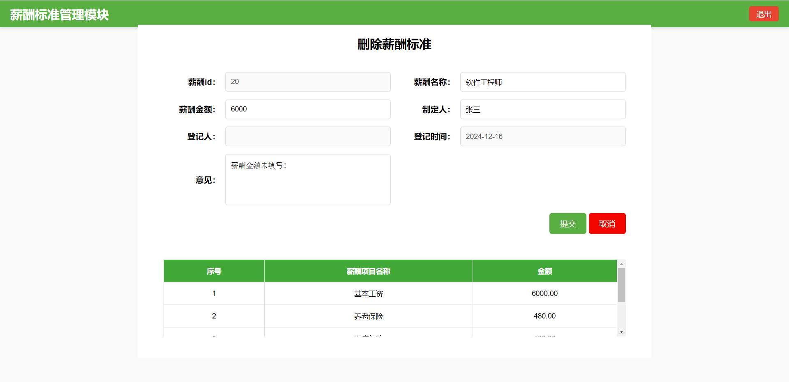

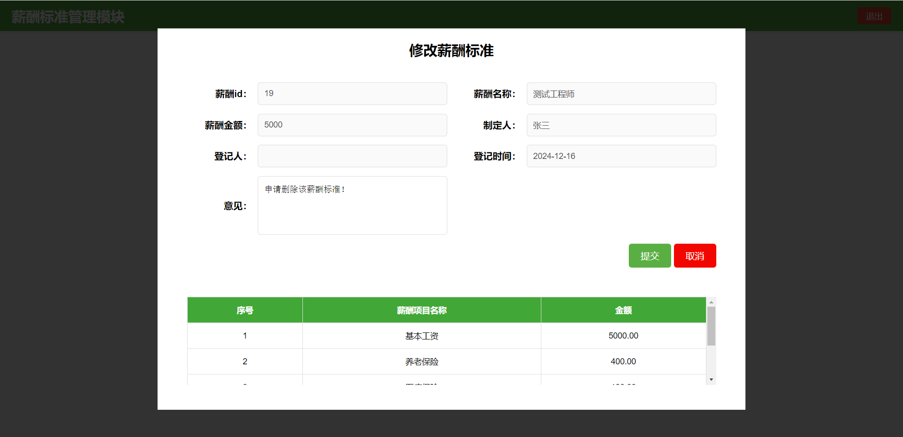

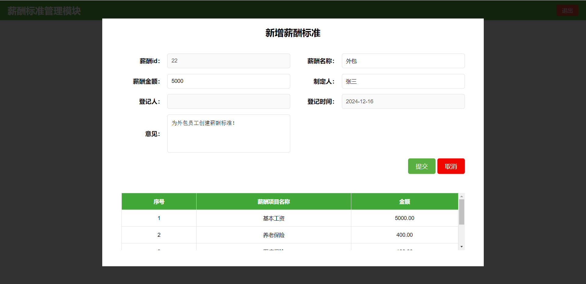

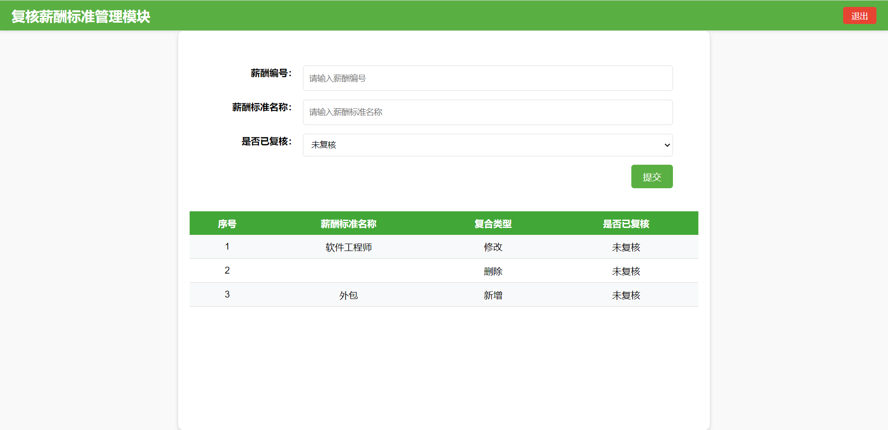

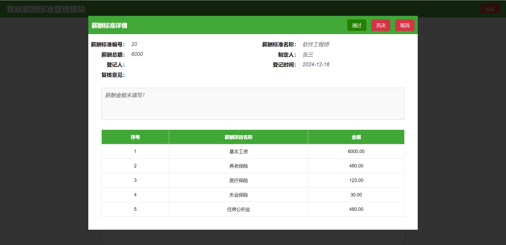

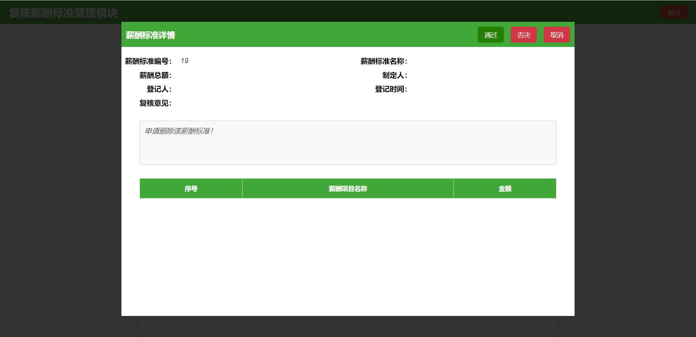

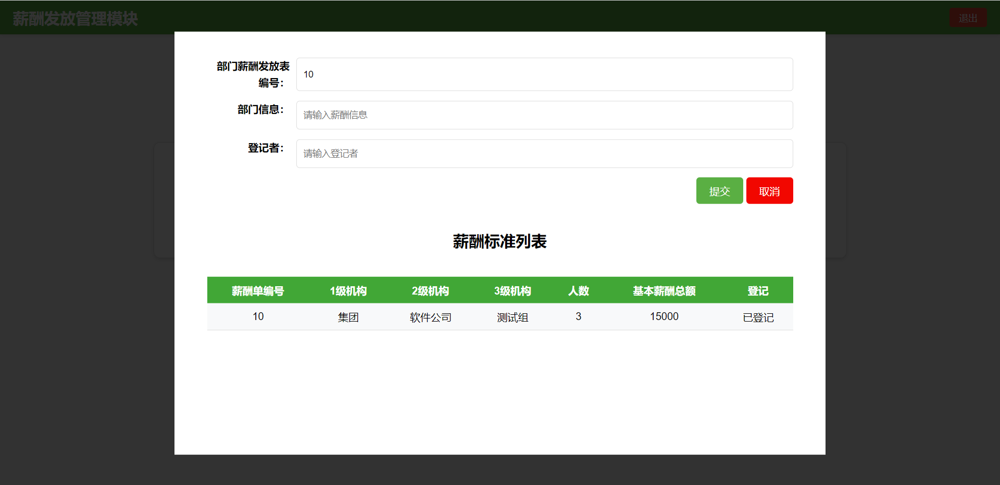

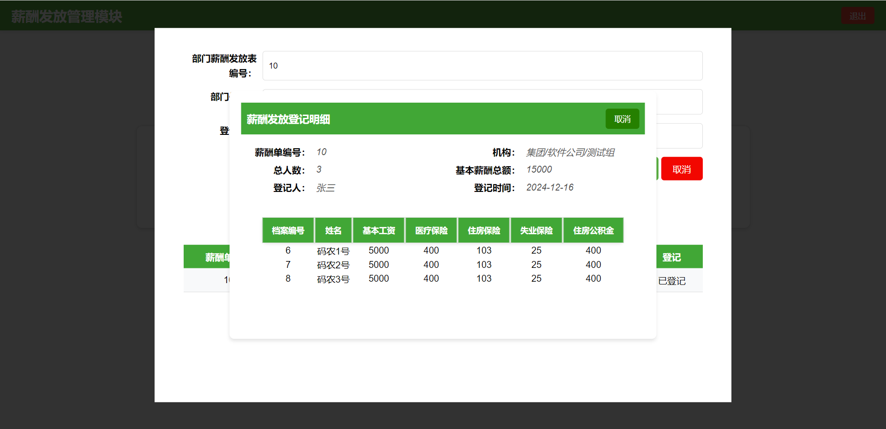

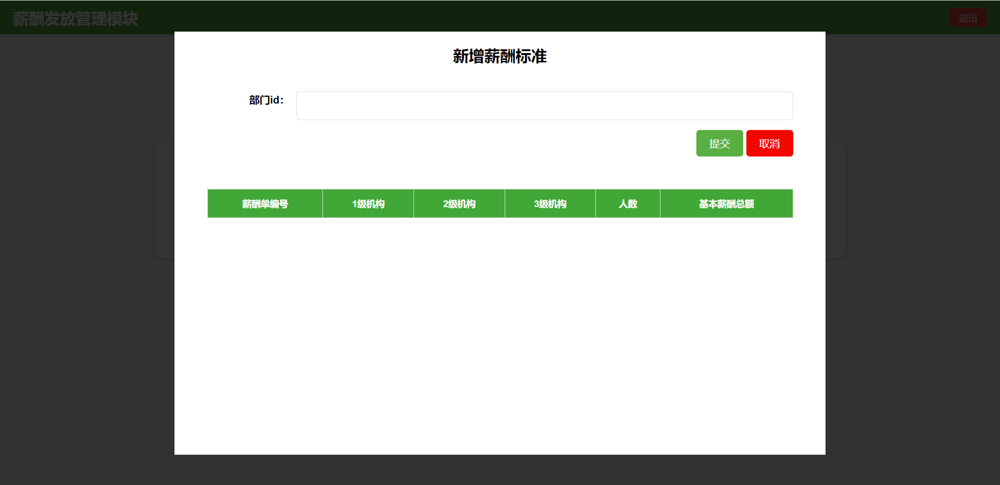


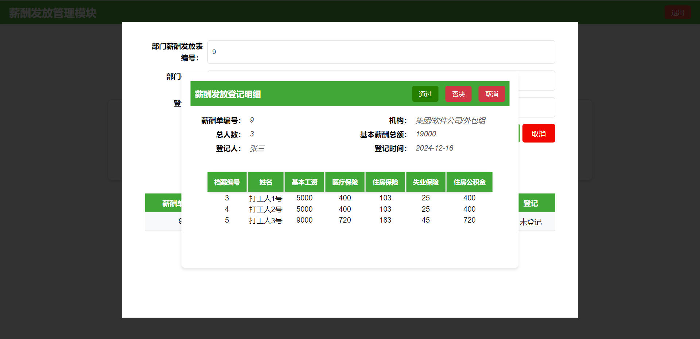

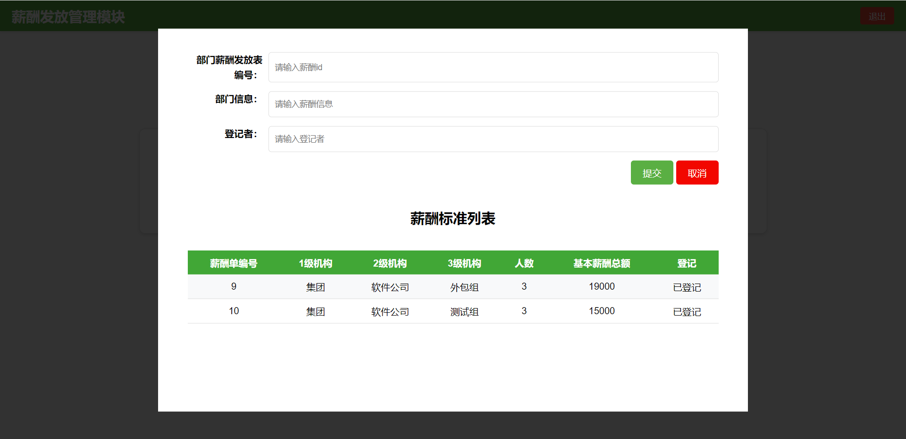

## 系统需求

### 1. 功能性需求
本系统主要为企业提供全方位的员工信息管理解决方案，包括以下功能：

- **用户认证与权限管理**：支持用户登录身份验证，依据角色分配权限，确保数据安全。
- **员工信息管理**：提供员工信息的添加、删除、更新和查询，支持多条件筛选。
- **组织结构管理**：管理企业组织架构，包括创建、更新、删除部门及维护层级关系。
- **职位信息管理**：管理各类职位的详细信息，如职位类型、名称和描述。
- **薪资管理**：基于员工与职位信息，生成并管理薪资单。
- **数据持久化与备份**：支持持久化存储，并提供数据库备份功能。

### 2. 非功能性需求
- **性能**：支持至少1000名员工的并发访问，响应时间不超过2秒。
- **安全性**：提供完善的权限控制，保护数据的机密性与完整性，防止未授权访问。
- **可用性**：确保系统可用性达到99.9%，保证关键业务连续性。
- **可维护性**：采用模块化设计，结构清晰，易于维护与扩展。
- **兼容性**：支持主流浏览器（Chrome、Firefox、Edge）及移动设备访问。

---

## 概要设计

### 1. 系统组织结构
采用典型三层架构，包含表现层（Controller）、业务逻辑层（Service）和数据访问层（Mapper）。系统部署在Linux服务器上，通过Docker Compose运行多个Spring Boot服务，分别是：

- 系统管理模块（System Administration）
- 人力资源档案管理模块（Human Resources File Management）
- 薪资模块（Salary）

这些模块使用Feign客户端进行通信，共享一个MySQL数据库，并通过JDBC Session实现会话共享。

#### 组织结构图


---

### 2. 系统架构
#### 2.1 运行环境
- **操作系统**：Linux
- **容器化平台**：Docker
- **编排工具**：Docker Compose

#### 2.2 技术栈
- **后端框架**：Spring Boot
- **数据库**：MySQL
- **持久层框架**：MyBatis
- **微服务通信**：Feign
- **会话管理**：Spring Session（JDBC模式）
- **API文档**：Swagger
- **容器管理**：Docker Compose

#### 2.3 三层架构
- **表现层**（Controller）：处理用户请求，接收并响应客户端需求。
- **业务逻辑层**（Service）：实现具体业务逻辑，调用数据访问层的接口。
- **数据访问层**（Mapper）：通过MyBatis与数据库交互，执行CRUD操作。

---

## 数据库设计

### 1. 核心表设计
**Employee 表**
- 员工档案信息，包括姓名、性别、联系方式、职位、所属组织等。
- 主要字段：档案ID、姓名、职位类别、所属组织、薪资标准等。

**Organization 表**
- 管理企业组织架构，支持多层级部门划分。
- 主要字段：组织ID、名称、层级、父级ID、状态等。

**PositionInfo 表**
- 管理职位信息，包括职位类型、职位名称及层级关系。
- 主要字段：职位ID、类型、名称、父级ID、启用状态等。

**User 表**

- 用户信息，用于登录和权限控制。
- 主要字段：用户ID、用户名、密码、邮箱、角色ID等。

**Role 表**
- 系统角色信息。
- 主要字段：角色ID、角色名称、描述等。

**Permission 表**
- 系统操作权限定义。
- 主要字段：权限ID、名称、描述等。

**SalaryStd 表**
- 定义不同的薪资标准。
- 主要字段：薪资标准ID、名称、总金额、制定人、制定时间等。

**DepartmentPayroll 表**
- 记录部门工资信息，包括员工数量、部门总工资等。
- 主要字段：部门工资单ID、部门名称、员工数量、总工资、审核状态等。

**EmployeePayroll 表**
- 记录每位员工的工资信息。
- 主要字段：员工工资单ID、部门ID、薪资标准ID、审核状态等。

---

## 详细设计

### 1. 类设计与包结构
**Controller 层**
- 提供RESTful接口，处理用户请求。
- 关键类：UserController、EmployeeController、PositionInfoController、OrganizationController。

**Service 层**
- 实现业务逻辑，调用数据访问接口。
- 关键类：UserService、EmployeeService、PositionInfoService、OrganizationService。

**Mapper 层**
- 使用MyBatis进行数据操作。
- 关键类：UserMapper、EmployeeMapper、PositionInfoMapper、OrganizationMapper。

**POJO 类**
- 定义实体类，如User、Employee、PositionInfo、Organization。


---

### 2. 模块划分
#### 系统管理模块
- 用户管理：添加、删除、修改用户。
- 权限管理：分配角色与权限。

#### 人力资源档案管理模块
- 员工档案管理：处理员工增删改查。
- 组织结构管理：创建、更新、删除部门。

#### 薪资模块
- 薪资标准管理：定义薪资级别。
- 工资单生成：为员工生成工资单，管理薪资发放。

---

### 3. 认证与权限
**实现细节**
- **权限注解**：@RequiresPermissions 标注需要权限的方法。
- **拦截器**：AuthenticationInterceptor 在请求处理前验证用户权限。
- **Feign 客户端**：调用远程用户信息服务，获取用户权限列表。

**认证流程**
1. 用户通过登录接口验证身份，获得会话。
2. 每次请求时，拦截器检查用户会话和权限。
3. 如果用户权限不足，则返回403错误。
4. 否则继续执行控制器逻辑。


---

## 系统测试

### 1. 单元测试
- 使用JUnit和Mockito对各个服务层方法进行单元测试。
- 确保每个方法的逻辑正确，覆盖率达85%以上。

### 2. 集成测试
- 使用Spring Boot Test和MockMvc测试Controller与Service的协作。
- 验证模块间的接口调用与数据流转。

### 3. 性能测试
- 使用JMeter模拟高并发场景，验证系统的响应时间和吞吐量。
- 在1000并发用户情况下，响应时间保持在2秒以内。

### 4. 安全测试
- OWASP ZAP自动化扫描，检查SQL注入、XSS等漏洞。
- 验证权限控制、会话管理及敏感数据加密。

### 5、集成Swagger API测试文档


---

## 部署与运行

### 1. Docker Compose 配置
**服务清单**
- MySQL数据库
- 系统管理模块
- 人力资源档案管理模块
- 薪资模块

**配置文件示例**
```yaml
version: '3.8'

services:
  mysql:
    image: mysql:8.0
    environment:
      MYSQL_ROOT_PASSWORD: 123456
      MYSQL_DATABASE: hrms
    ports:
      - "3306:3306"

  system-administration:
    image: openjdk:8-jdk-alpine
    command: ["java", "-jar", "system-admin.jar"]
    environment:
      SPRING_DATASOURCE_URL: jdbc:mysql://mysql:3306/hrms?useSSL=false
      SPRING_DATASOURCE_USERNAME: root
      SPRING_DATASOURCE_PASSWORD: 123456
    ports:
      - "8080:8080"

  hr-file:
    image: openjdk:8-jdk-alpine
    command: ["java", "-jar", "hr-file.jar"]
    environment:
      SPRING_DATASOURCE_URL: jdbc:mysql://mysql:3306/hrms?useSSL=false
      SPRING_DATASOURCE_USERNAME: root
      SPRING_DATASOURCE_PASSWORD: 123456
    ports:
      - "8081:8081"

  salary:
    image: openjdk:8-jdk-alpine
    command: ["java", "-jar", "salary.jar"]
    environment:
      SPRING_DATASOURCE_URL: jdbc:mysql://mysql:3306/hrms?useSSL=false
      SPRING_DATASOURCE_USERNAME: root
      SPRING_DATASOURCE_PASSWORD: 123456
    ports:
      - "8082:8082"
```


---

## 系统特色与优势

- **模块化设计**：系统采用微服务架构，每个模块独立开发、测试与部署。
- **安全可靠**：完善的权限控制机制，保障数据和业务安全。
- **高性能**：支持高并发场景，响应时间在2秒以内。
- **易于扩展**：模块化设计和容器化部署，便于功能扩展与维护。
- **丰富的功能**：涵盖员工信息、组织结构、职位与薪资管理。

---
